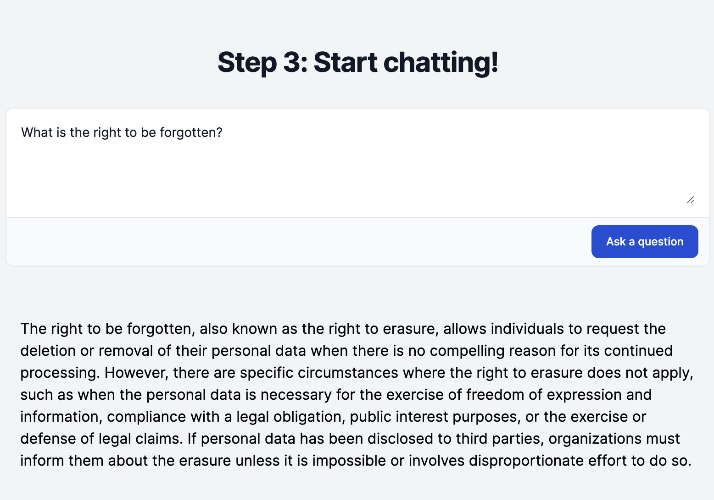

# Ask PDF

Ask PDF is a sample Ruby on Rails app demonstrating how to build a 'chat with
your document' service using GPT.

## How it works

1. When a PDF is uploaded, ActiveStorage is used to save the original uploaded
file.

2. A background job reads the text from the file and splits it up into chunks,
roughly based on paragraphs. For each chunk an embedding is created, and the
text and embeddings are saved togther in the database.

3. When the user submits a question about the document, an embedding is
 generated from the question. We then read the chunks, calculate the
similarity to the question, and select the top 5 chunks that are most similar
to the question.

4. A prompt is crafted consisting of the question and the text of those chunks, and
submitted to GPT-3, which returns a response to the user's question.

## Theory

In the context of LLMs, embeddings are vectors (an array of numbers) that are
used to represent words and sentences in the vector space that the LLM operates
in - basically a mathematical representation of the semantic meaning of the text.

Various mathematical operations can be used to calculate the similarity between
two embeddings. OpenAI recommend the use of a cosine similarity function. Given
the following sentences, this can be used to identify A and B have a closer
semantic meaning than C.

a) The colour of the sky is blue.
b) What colour is the sky?
c) The dog likes to run outside.

This is similar to how full text search works in PostgreSQL with the `tsvector`
column type. In fact, that could actually be used to achive a similar result,
however PostgreSQL only looks at words, where as OpenAI's embedding models are
more advanced in that they focus on the semantic meaning of the sentance or
text as a whole. If you had the sentence "The sky is blue" it would know that
this and B are similar as it understands 'colour' and 'blue' are semantically
similar, where as PostgreSQL would not.

There are various products such as Pinecone and Chroma that are popular for
storing AI embeddings, but in our case as we have a limited number, we just
store them as a JSON blob attached to the record in SQLite. When we need to
identify the embeddings that are closest we simply compare them all. Vector
databases provide indexes that allow you to more quickly identify embeddings
that are most similar, but for this service it's redundant as there are only a
limited number of embeddings - it would make sense to use such as database if
you wanted to search across a large number of documents.

When we want the LLM to answer a question we need to provide text from the
original document. For a small document you could maybe provide the whole text,
but if you have hundreds of pages this is not going to work well. First of all,
LLMs have a limit to the context size, i.e. how big the prompt can be (with
OpenAI's newest 128K models this is not such an issue), and they provide more
accurate answers if given only the relevant parts of the document.

When the user submits a question, we generate an embedding of the question. We
use that to identify the parts of the document that are most relevant, by
comparing the question embedding to the embeddings of the document. We then
include the most similar chunks in the prompt that is sent to the LLM

## Possible Improvements

### PDF Storage

PDFs are stored using ActiveStorage, so we can process them in a background
job. The 'Disk' service is used, which is fine for development purposes. If this
were to be deployed to production it would make sense to use a cloud storage
service, such as Amazon S3, and have files uploaded directly to there (not going
through Rails). However once we have processed the PDF and extracted the text,
the original file is no longer needed. However it probably makes sense to keep
it so we can reprocess files at a later point if we make changes to the
embedding system (e.g. switching to a newer model), and the cost of storing such
files on S3 would be minimal. Adding support for other document types
would also make sense.

### Chunking Improvements

The chunking algorithm used to generate each section of the document is very
naive. The current system tries to split text based on paragraphs, but this may
not respresent a meaningful semantic unit of text. Ideally the sections that
embeddings are generated on should be of a minimum size, so that they are big
enough to contain useful semantic data, but not too big that they contain too
much data and information is lost when the embedding is created. It may actually
make sense to pass the full document text to GPT to have that split into
sections.

### Embedding Storage

While storing the embeddings a JSON blob is fine for the service as is (as a
proof of concept). However there are limitations to the size of the data that
can be stored in SQLite. I tried to process a 250 page PDF document... and it
crashed spectacularly when trying to save all the embeddings. That could
probably be resolved by just having a row per embedding, rather than everything
in one record.

Even if we fixed that, if we wanted to change the system to query across
multiple documents, using a traditional SQL database would not scale well as we
would still need to load all the embeddings for each query. Storing the
embeddings in a dedicated vector database would improve performance (especially
in querying) and provide greater flexibility.

### Context Preservation

Each question is answered on it's own, and the context of previous questions
is lost. If we want to provide more of a chat experience, we could include
the previous questions and answers in the prompt, or use OpenAI's Threads API.

### UI Improvements

All requests the app makes are just basic HTTP requests with full page reloads.
We could use Stimulus to provide a bit more interactivity which would result in
a better user experience. Streaming the response from OpenAI would also make it
appear more interactive

The UI could also show the document, and scroll to the
most relevant section when a question is asked.

### Error Handling

Right now we don't handle errors when calling OpenAI. The embeddings are
generated as a background job, so using a job processor such as Sidekiq would
give us most of that for free (as any error would fail the job, which would be
retried). However we should add monitoring to make sure we don't call OpenAI's
APIs too much if a job is retried.

### Testing and Refactoring

There are no tests, so that would be a good thing to work on. Some parts of the
code could be more DRY. This is just a demonstration however, it isn't code that
is in use in production.
